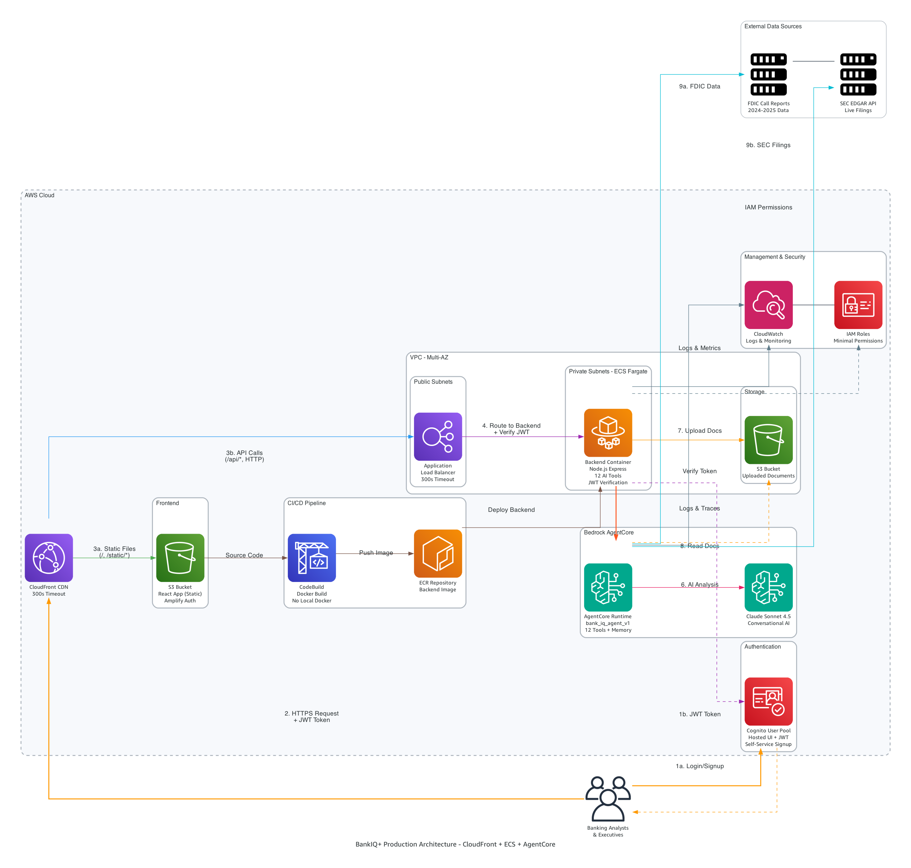

# BankIQ+ - AI Banking Analytics Platform
**Authors:** Shashi Makkapati, Senthil Kamala Rathinam, Jacob Scheatzle

## Background & Strategic Context

The advent of Generative AI has revolutionized how financial institutions process and interpret complex banking data. BankIQ+ represents a paradigm shift from traditional rule-based analytics to intelligent, context-aware financial analysis. By integrating AWS Bedrock AgentCore with Claude Sonnet 4.5, real-time FDIC data, and SEC EDGAR filings, the platform doesn't just present numbers—it understands relationships between metrics, identifies emerging trends, and generates human-like insights.

The AI agent can instantly correlate a bank's declining Net Interest Margin with industry-wide patterns, explain strategic implications of capital changes, or predict potential regulatory concerns based on CRE concentration trends. This GenAI-powered approach transforms raw regulatory data into conversational insights, enabling bank executives to ask natural language questions like "Why is our ROA underperforming compared to similar-sized banks?" and receive comprehensive, contextual analysis that considers market conditions, regulatory environment, and peer performance.

## 🚀 Quick Start

```bash
# Deploy to AWS
./cfn/scripts/deploy-all.sh

# Access at CloudFront URL (output after deployment)
```


## ✨ Features

- **Secure Authentication** - AWS Cognito with self-service signup
- **Peer Bank Analytics** - FDIC data comparison
- **Financial Reports** - SEC filings analysis
- **CSV Upload** - Custom data analysis
- **Document Chat** - AI-powered Q&A

## 🏗️ AWS Architecture



**Key Components:**
- **Cognito User Pool**: Secure authentication with Hosted UI and JWT tokens
- **CloudFront CDN**: Global content delivery with 300-second timeout
- **Application Load Balancer**: Routes API traffic to ECS containers
- **ECS Fargate**: Serverless containers in private subnets with JWT verification
- **AWS Bedrock AgentCore**: Managed AI agent runtime with 12 tools
- **Claude Sonnet 4.5**: Advanced AI analysis and conversational memory
- **S3 Storage**: Frontend hosting and document uploads
- **VPC with Multi-AZ**: High availability deployment
- **IAM Roles**: Minimal permissions for secure access
- **CloudWatch**: Comprehensive logging and monitoring

### Architecture Deep Dive

BankIQ+ follows a modern, cloud-native architecture built on AWS services with security-first design. User requests flow through [CloudFront](https://docs.aws.amazon.com/AmazonCloudFront/latest/DeveloperGuide/Introduction.html) for global content delivery, routing static files from [S3](https://docs.aws.amazon.com/s3/) and API calls to the [Application Load Balancer](https://docs.aws.amazon.com/elasticloadbalancing/latest/application/introduction.html). The ALB distributes traffic to containerized applications running on [Amazon ECS Fargate](https://docs.aws.amazon.com/AmazonECS/latest/developerguide/AWS_Fargate.html), eliminating server management while providing automatic scaling.

The platform's intelligence comes from [AWS Bedrock AgentCore](https://docs.aws.amazon.com/bedrock/latest/userguide/agents.html), which orchestrates 12 specialized tools for banking analytics. The agent uses [Claude Sonnet 4.5](https://www.anthropic.com/claude) for natural language understanding and maintains conversational memory across sessions. External data integration includes FDIC APIs for real-time banking metrics and SEC EDGAR APIs for financial filings. Documents uploaded to S3 are analyzed using PyPDF2 for metadata extraction and Claude for comprehensive analysis.

Security is embedded throughout: [AWS Cognito](https://docs.aws.amazon.com/cognito/) provides enterprise-grade authentication with OAuth 2.0 and JWT tokens, Fargate containers run in private subnets with JWT verification, [IAM roles](https://docs.aws.amazon.com/IAM/latest/UserGuide/introduction.html) provide fine-grained access control, and [CloudWatch](https://docs.aws.amazon.com/cloudwatch/) enables comprehensive monitoring. The architecture eliminates API Gateway's 30-second timeout limitation, supporting long-running queries up to 300 seconds. Infrastructure is deployed through [CloudFormation](https://docs.aws.amazon.com/cloudformation/) templates, ensuring consistent, repeatable deployments.

## 🛠️ Technology Stack

- **AI**: AWS Bedrock AgentCore + Claude Sonnet 4.5
- **Agent**: Strands framework
- **Authentication**: AWS Cognito + AWS Amplify v6
- **Backend**: Express.js + Python
- **Frontend**: React + Material-UI
- **Infrastructure**: ECS Fargate, ALB, CloudFront, S3

## 📖 Documentation

- **[DEPLOYMENT_GUIDE.md](DEPLOYMENT_GUIDE.md)** - Complete deployment guide with Cognito setup
- **[backend/README_AGENT.md](backend/README_AGENT.md)** - Agent documentation
- **[arch/](arch/)** - Architecture diagrams

## ✨ Platform Features

### 📊 Peer Bank Analytics
- **500+ Banks**: Access entire SEC EDGAR database
- **Live FDIC Data**: Real-time financial metrics and trends
- **Custom CSV Upload**: Analyze your own peer data
- **AI-Powered Comparison**: Automated tool selection by Claude

### 📋 Financial Reports Analyzer
- **SEC Filings**: 10-K and 10-Q analysis for any public bank
- **Document Upload**: Analyze your own financial PDFs
- **Conversational Memory**: Context-aware across queries
- **AI Chat**: Interactive Q&A about uploaded documents

### 🔧 Analysis Modes
1. **Live FDIC**: Real-time banking metrics from FDIC Call Reports
2. **SEC EDGAR**: Direct integration with SEC.gov APIs
3. **Document Upload**: PDF analysis with metadata extraction
4. **Chat Mode**: Conversational analysis with memory

## 🏦 Supported Banks & Metrics

**500+ Banks** from SEC EDGAR database including:
- JPMorgan Chase, Bank of America, Wells Fargo, Citigroup
- Goldman Sachs, Morgan Stanley, U.S. Bancorp, PNC Financial
- Capital One, Truist Financial, Webster Financial, and 490+ more

**Key Banking Metrics:**
- **ROA** - Return on Assets: Net income as % of average assets
- **ROE** - Return on Equity: Net income as % of average equity
- **NIM** - Net Interest Margin: Interest spread as % of assets
- **Efficiency Ratio** - Operating expenses as % of revenue
- **Loan-to-Deposit** - Loans as % of deposits
- **CRE Concentration** - Commercial real estate loans as % of capital

## 🎯 AI Agent Tools (12 total)

1. `get_fdic_data` - Current FDIC banking data
2. `search_fdic_bank` - Search FDIC by bank name
3. `compare_banks` - Peer performance comparison
4. `get_sec_filings` - SEC EDGAR filings
5. `generate_bank_report` - Comprehensive analysis
6. `answer_banking_question` - General Q&A
7. `search_banks` - Bank search by name/ticker
8. `upload_csv_to_s3` - Upload CSV data
9. `analyze_csv_peer_performance` - Analyze CSV
10. `analyze_and_upload_pdf` - Upload and analyze PDFs
11. `analyze_uploaded_pdf` - Analyze PDFs in S3
12. `chat_with_documents` - Chat with docs/filings

## ⚠️ CRITICAL: Dockerfile Naming

**Two separate Dockerfiles:**
- `backend/Dockerfile` = Python agent (AgentCore) - DO NOT RENAME
- `backend/Dockerfile.backend` = Node.js API server (ECS)

See `backend/README_AGENT.md` for details.

## 🔧 Prerequisites

- AWS Account with Bedrock access
- AWS CLI configured
- Docker installed
- Node.js 18+
- Python 3.11+

## 🚀 Deployment Guide

### Prerequisites

**Required:**
- AWS Account with administrative access
- AWS Bedrock access enabled (see setup below)
- AWS CLI configured (`aws configure`)
- Docker installed
- Node.js 18+
- Python 3.11+
- AgentCore CLI: `pip install bedrock-agentcore-starter-toolkit`

**Enable Bedrock Access:**
1. Go to [AWS Bedrock Console](https://console.aws.amazon.com/bedrock/)
2. Navigate to **Model Access** in the left sidebar
3. Click **Request model access**
4. Enable: **Anthropic Claude Sonnet 4.5**
5. Wait for approval (usually instant)

### Step-by-Step Deployment

**Step 1: Clone Repository**
```bash
git clone https://github.com/smakkapati-repo/peer-bank-analytics-agentic.git
cd peer-bank-analytics-agentic
```

**Step 2: Install AgentCore CLI**
```bash
pip install bedrock-agentcore-starter-toolkit
agentcore --version  # Verify installation
```

**Step 3: Configure AWS CLI**
```bash
aws configure
# Enter your AWS Access Key ID
# Enter your AWS Secret Access Key
# Enter region: us-east-1
# Enter output format: json
```

**Step 4: Deploy Everything (One Command)**
```bash
./cfn/scripts/deploy-all.sh
```

**Deployment Progress:**
- 🔵 **[1/4] AgentCore Agent** (~3-5 minutes)
  - Builds and deploys Python agent with 12 tools
  - Adds S3 permissions automatically
  - Creates conversational memory

- 🔵 **[2/4] Infrastructure** (~5-7 minutes)
  - VPC with public/private subnets
  - Application Load Balancer
  - ECS cluster
  - S3 buckets

- 🔵 **[3/4] Backend** (~3-5 minutes)
  - Builds Docker image
  - Pushes to ECR
  - Deploys ECS service

- 🔵 **[4/4] Frontend** (~2-3 minutes)
  - Builds React app
  - Uploads to S3
  - Creates CloudFront distribution

**Total Time**: ~15-20 minutes

**Step 5: Access Your Application**

After deployment completes, you'll see:
```
✅ DEPLOYMENT COMPLETE!
🌐 CloudFront URL: https://d2mlfyaj7qolx.cloudfront.net
```

Open the CloudFront URL in your browser to access BankIQ+!

## 🔍 Verify Deployment

**Check Health:**
```bash
# Get CloudFront URL
CLOUDFRONT_URL=$(aws cloudfront list-distributions --query "DistributionList.Items[?contains(Origins.Items[0].DomainName, 'bankiq-frontend')].DomainName" --output text)

# Test health endpoint
curl https://$CLOUDFRONT_URL/api/health
# Expected: {"status":"healthy","service":"BankIQ+ Backend"}
```

**View Logs:**
```bash
# ECS backend logs
aws logs tail /ecs/bankiq-backend --follow

# AgentCore logs
agentcore status
```

## 💰 Cost Estimate

Monthly costs (24/7 operation):
- ECS Fargate: $15-20
- ALB: $16-20
- CloudFront: $1-5
- S3: $1-2
- Bedrock: $10-30

**Total**: ~$50-90/month

## 🧹 Cleanup

To delete all resources:

```bash
./cfn/scripts/cleanup.sh
```

This will remove:
- ✅ CloudFormation stacks
- ✅ S3 buckets (with contents)
- ✅ ECR images and repositories
- ✅ ECS cluster and services
- ✅ CloudFront distribution
- ✅ AgentCore agent
- ✅ All associated resources

**Time**: ~10-15 minutes

## 📝 Monitoring

```bash
# View ECS logs
aws logs tail /ecs/bankiq-backend --follow

# View AgentCore logs
agentcore status
```

## 🆘 Troubleshooting

**Issue**: CloudFront returns 502
- Check ECS task health
- Check ALB target health
- View logs: `aws logs tail /ecs/bankiq-backend --follow`

**Issue**: Agent not responding
- Check AgentCore status: `agentcore status`
- Verify agent ARN in ECS task environment variables

## 📄 License

MIT License

## 👥 Authors

Shashi Makkapati, Senthil Kamala Rathinam, Jacob Scheatzle
